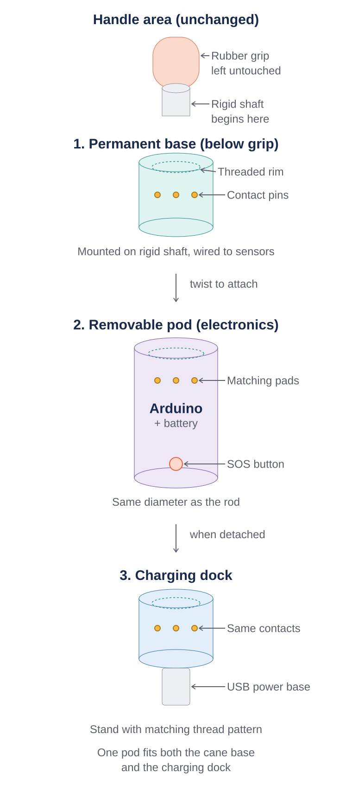

# PathSense — Smart Cane for Safer Navigation

A smart cane prototype built for **Build X by Blankspace** (Arduino-sponsored hackathon).

PathSense adds three layers of protection to a standard cane:
- **Side obstacle detection** — dual ultrasonic sensors sense objects left and right
- **Ground depth sensing** — detects sudden drops (potholes) or rises (curbs/steps) ahead
- **Emergency SOS** — a button triggers an audible alarm for nearby help

## Team
2-member team, Amal Jyothi College of Engineering

## Problem

The traditional white cane has real limitations: it only detects ground-level obstacles, missing hazards at chest or head height. Worse, it cannot sense depth changes ahead — potholes, open drains, or curbs are noticed only after the user has already stepped into danger. There's also no built-in way to alert others during a fall or emergency. These gaps matter especially in regions like Kerala, where uneven roads and monsoon puddles are common daily hazards.

## System Diagram

## How It Works

1. **Sense** — Ultrasonic sensors continuously scan the path ahead and below
2. **Process** — A microcontroller checks readings against safe-distance thresholds
3. **Alert** — Vibration feedback (or SOS alarm) tells the user what to do

## Detachable Electronics Housing

The Arduino and battery sit in a cylindrical pod, matching the cane's rod diameter, that twist-locks onto a permanent base mounted on the rigid shaft just below the rubber grip (so the grip itself stays untouched). The same pod twists into a charging dock using an identical thread pattern and contact layout, so one pod works for both the cane and charging.

- **Permanent base** — fixed collar on the rigid shaft, wired to the shaft sensors, with a threaded rim and contact pins
- **Removable pod** — houses the Arduino, battery, and SOS button; matching contact pads connect power/data when twisted in
- **Charging dock** — same thread + contact pattern as the cane base, so the pod docks directly for charging

Electrical contact between the pod and either base is made using **pogo pin connectors** — spring-loaded pins that connect simply by being seated together, well suited to a twist-lock mechanism.

## Components

| Component | Purpose |
|---|---|
| Arduino Nano | Microcontroller |
| HC-SR04 x2 | Left/right obstacle detection |
| ToF sensor (VL53L0X) | Ground depth sensing |
| Vibration motor | Feedback |
| Push button + buzzer | SOS alert |
| Pogo pin connectors | Detachable pod-to-base electrical contact |

## Status

Currently in pitch/prototype stage — circuit logic tested in [Wokwi](https://wokwi.com) simulator.
